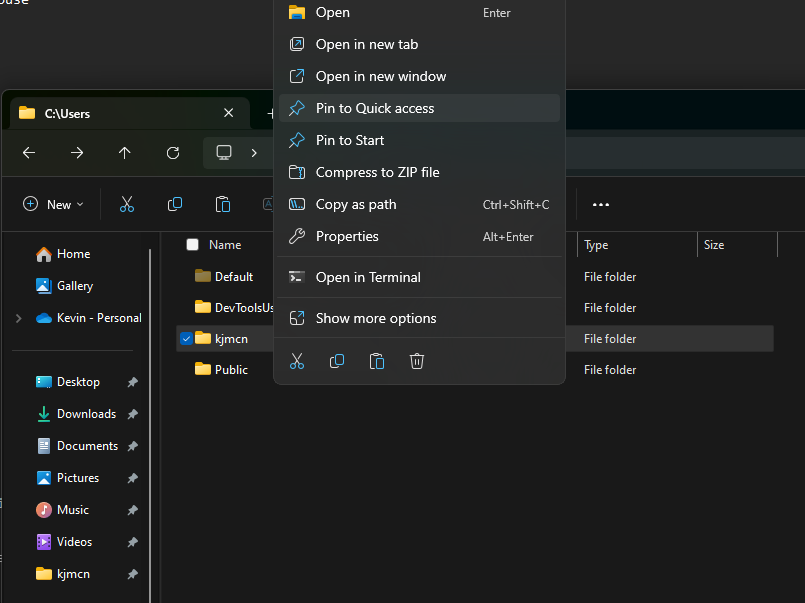
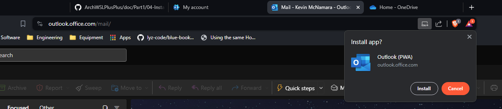
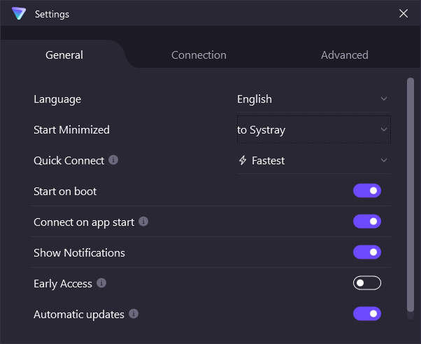

# dotfiles

## Login Manager

## Desktop Environment

[Hyprland](https://wiki.hypr.land/)

## Fonts

- [JetBrains Mono](https://www.programmingfonts.org/#jetbrainsmono)

## TUIs

- [Impala](https://github.com/pythops/impala) - TUI for managing wifi on Linux
- [Bluetui](https://github.com/pythops/bluetui) - TUI for managing bluetooth on Linux
- [Dust](https://github.com/bootandy/dust) - A more intuitive version of du in rust

## Arch Linux

### Installation

Make sure to UEFI Boot from live USB

#### [Connect to Wifi](https://wiki.archlinux.org/title/Iwd#iwctl)

```sh
iwctl
station wlan0 get-networks # Scan/List networks
station wlan0 connect SSID # Connect to network
```

Enter passphrase when prompted.

```sh
station wlan0 show # Confirm connection
exit # Exit back to commandline
```

#### Automated Install Script

```sh
# mount -m -t nfs snow.local:/mnt/md1 /nas # to save config file to nas
mount -m -t cifs //192.168.0.10/NAS /nas -o username=admin # cifs-utils comes packaged with archiso
bash -c "$(curl -s https://raw.githubusercontent.com/kjmcnamara1/dotfiles/refs/heads/main/arch/install)"
# curl -s https://raw.githubusercontent.com/kjmcnamara1/dotfiles/main/scripts/MUSE.sh > /tmp/tmp.sh
# bash /tmp/tmp.sh
```

Script will prompt for:

1. archinstall config name (default=muse)
2. root password
3. Admin username (default=kjm) and password

You will need to select options for disk layout. Any other preconfigured options can be changed before beginning install.

Arch linux will be installed.

Select "No" when asked to chroot into the new installation.

Script will ask if you want to install chezmoi dotfiles.

Script will prompt to reboot.

### Configuration

Log in via tty with the Admin user credentials you supplied during the install script.

Connect to the internet with networkmanager tui:

```sh
nmtui
```

**Activate a connection** > Select Wi-Fi network > Enter _password_ > **OK** > **Back** > **Quit**

Clone dotfiles git repo and run:

```sh
git clone https://github.com/kjmcnamara1/dotfiles ~/dotfiles && cd ~/dotfiles
./dotbot muse cosmic
```

Login via login manager (e.g. sddm).

#### Change dotfiles repo to use SSH

```sh
gh auth login
git remote set-url origin git@github.com:kjmcnamara1/dotfiles
```

### OneDrive

```sh
onedrive
```

1. Paste URL into browser
2. Log in to MS OneDrive
3. Copy URL of addressbar of the blank page that results and paste into terminal

### Tmux

Start `tmux`

Install plugins
prefix (ctrl-a) + I (shift-i)

### QEMU

```sh
yay -S qemu virt-manager virt-viewer dnsmasq vde2 bridge-utils openbsd-netcat iptables libguestfs
sudo usermod -aG libvirt $(whoami)
systemctl enable libvirtd
systemctl start libvirtd
```

## Windows

### Keyboard

[dual-key-remap](https://github.com/ililim/dual-key-remap)

```powershell
# Download
# extract to C:\Program Files\dual-key-remap
# create shortcut @ C:\Users\%USERNAME%\AppData\Roaming\Microsoft\Windows\Start Menu\Programs\Startup\dual-key-remap.lnk
```

### Windows Settings

- System
  - Display
    - Configure displays
    - Laptop Display > Scale = 125%
  - Multitasking
    - Show tabs from apps when snapping or pressing Alt+Tab = Don't show tabs
  - For developers
    - Developer Mode = On
    - End Task = On
    - File Explorer = All On
    - Terminal = Windows Terminal
  - Clipboard
    - Clipboard history = On
- Bluetooth & devices
  - Devices
    - Add device
      - Logitech MX Master 3 Mouse
      - Work Earbuds
  - Printers & scanners > Add device =
  - Phone Link = On
  - Touchpad
    - Advanced gestures
      - Three-finger gestures
        - Tap = Middle mouse button
        - Swipe up = Volume Up
        - Swipe down = Volume down
        - Swipe left = Switch apps
        - Swipe right = Switch apps
      - Four-finger gestures
        - Tap = Notification center
        - Swipe up = Multitasking view
        - Swipe down = Show desktop
        - Swipe left = Switch desktops
        - Swipe right = Switch desktops
- Network & internet
- Personalization
  - Background
    - Personalize your background = Slideshow
    - Shuffle the picture order = On
  - Colors
    - Choose your mode = Dark
  - Taskbar
    - Search = Hide
    - Task view = Off
    - Chat = Off
    - Pen menu = On
- Windows Update
  - Get the latest updates as soon as they're available = On
  - Check for updates

#### Windows Explorer

- General
  - Open File Explorer To = This PC



#### Taskbar

Unpin:

- Microsoft Edge
- Windows Store
- Microsoft Teams

#### Desktops

Create 4 Desktops named:

1. Office
1. Terminal
1. Extra
1. Personal


### [Scoop](https://scoop.sh/)

```powershell
# Install scoop
Set-ExecutionPolicy -ExecutionPolicy RemoteSigned -Scope CurrentUser
Invoke-RestMethod -Uri https://get.scoop.sh | Invoke-Expression

# main bucket
scoop install git pwsh python poetry pyenv win32yank clink eza

scoop bucket add extras
scoop bucket add versions
scoop bucket add nerd-fonts
scoop bucket add nonportable

# nerd-fonts bucket
scoop install JetBrainsMono-NF VictorMono-NF FiraCode-NF FiraCode-Script NerdFontsSymbolsOnly
# extras bucket
scoop install vscode wezterm megasync freecad inkscape gimp obsidian starship vcredist2022
```

Need to run as Admin

```powershell
# nonportable bucket
scoop install protonvpn-np
```

### Configure Programs

#### SonicWalll NetExtender

Disable Settings > Privacy & security > Windows Security > Device security > Core isolation > Memory integrity = Off

Install OneDrive\IT\Reimage Setup Files\NetExtender.MSI

Default Server: vpn.fivestarproducts.com
Default Domain: hqfsp
Allow connections to other profiles

#### I Drive

Connect to FSP Network or VPN

Run OneDrive\IT\Map I Drive.bat

#### [Brave Browser](https://brave.com/download/)

<!--
```powershell
# download from https://laptop-updates.brave.com/download/BRV011?bitness=64
# run install file
``` -->

Download and install as regular application
Set Brave as default browser
Skip import
Help make Brave better = Check all
brave://sync > enter Work sync code > Sync everything
hamburger > More tools > Add new profile = Personal
brave://sync > enter Personal sync code > Sync everything
Change Profile name and icon for both
Settings > Content > Content > Cycle through the most recently used tabs with Ctrl-Tab = On
Sign into Proton Pass
Set as default browser

<!-- Create symlink for userdata to scoop userdata -->

<!--
```powershell
# Needs elevation for some reason even though in Developer Mode
New-Item -Path 'C:\Users\kjmcn\AppData\Local\BraveSoftware\Brave-Browser\User Data' -ItemType SymbolicLink -Value 'C:\Users\kjmcn\scoop\persist\brave\User Data'
``` -->

<!-- ```powershell -->
<!-- cmd -->
<!-- mklink /d "C:\Users\kjmcn\AppData\Local\BraveSoftware\Brave-Browser\User Data" "C:\Users\kjmcn\scoop\persist\brave\User Data" -->
<!-- exit -->
<!-- ``` -->

#### [VS Code](https://code.visualstudio.com)

Sync with github account
Sign in with Codeium Auth using google account

#### Microsoft Office

##### [Office 365](https://www.office.com/?auth=2)

Sign in with Work account
Download [Office 365](https://portal.office.com/account/?ref=Harmony#installs)
Run OfficeSetup.exe
Log in with Work account > Only this App

##### [Outlook (PWA)](https://outlook.office.com/mail/)



Install Outlook PWA
Pin to taskbar

##### Microsoft Teams (work or school)

Log in with Work account > Only this App

##### [OneDrive - Work](https://fivestarproducts-my.sharepoint.com/personal/mcnamarak_fivestarproducts_com//_layouts/15/onedrive.aspx?login_hint=McNamaraK%40fivestarproducts%2Ecom&view=1)

Settings > Add account
Log in with work account
Sign into this app only

##### [SharePoint](https://fivestarproducts.sharepoint.com/_layouts/15/sharepoint.aspx)

Sync:

- [Five Star Continuous Improvement](https://fivestarproducts.sharepoint.com/sites/FiveStarContinuousImprovement)
  - [Documents](https://fivestarproducts.sharepoint.com/sites/FiveStarContinuousImprovement/Shared%20Documents/Forms/AllItems.aspx)
  - [Five Star Marine](https://fivestarproducts.sharepoint.com/sites/FiveStarContinuousImprovement/Five%20Star%20Marine/Forms/AllItems.aspx)
  - [Harahan](https://fivestarproducts.sharepoint.com/sites/FiveStarContinuousImprovement/Harahan/Forms/AllItems.aspx)
- [CI Sandbox](https://fivestarproducts.sharepoint.com/sites/CISandbox)
  - [Documents](https://fivestarproducts.sharepoint.com/sites/CISandbox/Shared%20Documents/Forms/AllItems.aspx)

#### [Logi Options+](https://www.logitech.com/en-us/software/logi-options-plus.html)

Log in with google account

#### [Proton VPN](https://protonvpn.com/download-windows)

Log in
Change Settings > General > Start Minimized = to Systray


#### [Proton Drive](https://proton.me/drive/download)

Don't backup any folders
Use default sync location (C:\Users\kjmcn\Proton Drive\kevin.j.mcnamara)

#### MegaSync

Do not backup
Do not sync inside OneDrive/Documents
Sync to C:\Users\kjmcn\MEGA
Remove .\* from 'excluded file and folder names' in Settings > Folders


#### [Dell Active Pen Service](https://www.dell.com/support/home/en-us/product-support/product/dell-ap-pn5122w/drivers)

Dell Active Pen PN5122W

#### [TeamViewer](https://www.teamviewer.com/en-us/)

Download and install (not through scoop) for unattended access.
[](https://download.teamviewer.com/download/TeamViewer_Setup_x64.exe)

Log in with TeamViewer credentials.

Settings > General > Dark Mode = On
Settings > General > Start TeamViewer with Windows = On
Devices > All managed devices > Add device > Set up remote access on this device

#### Windows Terminal

Hide Windows PowerShell
Set PowerShell Core as default

Turn on clink autorun and transient prompt

```powershell
clink autorun install
clink set prompt.transient same_dir
```

#### Git

```powershell
git config --global user.name 'Kevin J. McNamara'
git config --global user.email kjmcnamara1@gmail.com
```

### Windows Subsystem for Linux (WSL)

Enable WSL

```powershell
wsl --install --no-distribution
# Reboot
Restart-Computer
```

Install Arch WSL

```powershell
scoop install archwsl
arch                                                  # start archwsl
```

```sh
passwd                                                # Set root password
echo "%wheel ALL=(ALL) ALL" > /etc/sudoers.d/wheel    # This creates the sudoers file
useradd -m -G wheel -s /bin/bash kevin                # Create a new user
passwd kevin                                          # Set the password for the new user
exit                                                  # Return to powershell
```

```powershell
arch config --default-user kevin                      # Change default user
arch
```

```sh
# Set up arch keyring and base packages
sudo pacman-key --init
sudo pacman-key --populate
sudo pacman -Syu                                      # Update all system packages
sudo pacman -S archlinux-keyring
sudo pacman -S --needed base-devel git

# Install yay AUR helper
git clone https://aur.archlinux.org/yay.git
cd yay
makepkg -si
yay --version
cd
rm -rf ~/yay

# Install packages
yay -S wget curl man-db carapace-bin fish eza fzf neovim-nightly-bin nodejs npm nushell openssh ripgrep fd starship tmux unzip zoxide zstd python-poetry pyenv

# Change python3 symlinks to point to python3.12 instead of 3.11
# sudo ln -sf python3.12 /usr/bin/python3
# sudo ln -sf python3.12-config /usr/bin/python3-config
# sudo ln -sf pydoc3.12 /usr/bin/pydoc3

# Python
pyenv install 3.12
pyenv global 3.12

# Create SSH key for github
# ssh-keygen -t ed25519 -C "$(whoami)@$(uname -n)-$(date -I)" -f ~/.ssh/github_com_ed25519
ssh-keygen

# Print public key to screen and copy
cat ~/.ssh/id_ed25519.pub
```

Create a [new ssh key](https://github.com/settings/ssh/new) on github.

```sh
# Run ssh-agent in the background
eval "$(ssh-agent -s)"
# Add private key to the ssh agent
# ssh-add ~/.ssh/github_com_ed25519
ssh-add ~/.ssh/id_ed25519
# Connect to github to add github.com to known_hosts
ssh -T git@github.com

# Clone dotfiles
mkdir ~/Code && cd ~/Code && git clone --recurse-submodules git@github.com:kjmcnamara1/dotfiles && cd dotfiles

# Sync Linux dotfiles
./sync.py

# Sync Windows dotfiles
python.exe ./sync.py -i [] -l wezterm starship starship.toml starship.lua .ipython .gitconfig Microsoft.PowerShell_profile.ps1

# Link dirs to Windows
cd
ln -sd /mnt/c/Users/kjmcn WIN
ln -sd /mnt/c/Users/kjmcn/Documents
ln -sd /mnt/c/Users/kjmcn/Downloads
ln -sd /mnt/c/Users/kjmcn/Music
ln -sd /mnt/c/Users/kjmcn/Videos
ln -sd /mnt/c/Users/kjmcn/MEGA
ln -sd "/mnt/c/Users/kjmcn/Proton Drive/kevin.j.mcnamara/My files" Proton
ln -sd "/mnt/c/Users/kjmcn/OneDrive - Five Star Products, Inc" OneDrive
ln -sd "/mnt/c/Users/kjmcn/Five Star Products, Inc" SharePoint

# Change default shell to fish
chsh -s /usr/bin/fish

# Link Windows dirs to WSL
cd ~/WIN
cmd.exe /c "mklink /d WSL \\\\wsl.localhost\\Arch\\home\\kevin"
cmd.exe /c "mklink /d .ssh \\\\wsl.localhost\\Arch\\home\\kevin\\.ssh"
cmd.exe /c "mklink /d Code \\\\wsl.localhost\\Arch\\home\\kevin\\Code"

# Link root to home
# sudo cd /root
sudo ln -sf /home/kevin/.config/starship.toml /root/.config
sudo ln -sdf /home/kevin/.config/fish /root/.config
sudo ln -sdf /home/kevin/.config/starship /root/.config
```

<!-- ```cmd -->
<!-- cd %USERPROFILE% -->
<!-- mklink /d .ssh \\wsl.localhost\Arch\home\kevin\.ssh -->
<!-- mklink /d Code \\wsl.localhost\Arch\home\kevin\Code -->
<!-- bash.exe -->
<!-- ``` -->

```bash
# Try to use bashe.exe -c 'cmd' to not have to change shells
# Run ssh-agent in the background
eval "$(ssh-agent -s)"
# Add private key to the ssh agent
# ssh-add ~/.ssh/github_com_ed25519
ssh-add ~/.ssh/id_ed25519
# Connect to github to add github.com to known_hosts
ssh -T git@github.com
wsl
```

#### Tmux

```fish
# Install Tmux Plugin Manager
git clone https://github.com/tmux-plugins/tpm ~/.cache/tmux/plugins/tpm

# Start tmux
tmux
```

Install plugins
prefix (ctrl-a) + I (s-i)

<!-- CascadiaCode-NF   -->
<!-- FiraCode   -->
<!-- IBMPlexMono-NF   -->
<!-- Iosevka-NF   -->
<!-- IosevkaTerm-NF   -->
<!-- JetBrains-Mono   -->
<!-- lazygit   -->
<!-- Victor-Mono   -->
<!-- zig -->
