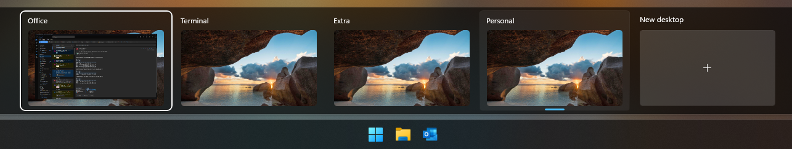

# dotfiles

## Windows

### Keyboard

[dual-key-remap](https://github.com/ililim/dual-key-remap)

```pwsh
# Download
# extract to C:\Program Files\dual-key-remap
# create shortcut @ C:\Users\%USERNAME%\AppData\Roaming\Microsoft\Windows\Start Menu\Programs\Startup\dual-key-remap.lnk
```

### Windows Settings

- System
  - Display
    - Configure displays
    - Laptop Display > Scale = 125%
  - Multitasking
    - Show tabs from apps when snapping or pressing Alt+Tab = Don't show tabs
  - For developers
    - Developer Mode = On
    - End Task = On
    - File Explorer = All On
    - Terminal = Windows Terminal
  - Clipboard
    - Clipboard history = On
- Bluetooth & devices
  - Devices
    - Add device
      - Logitech MX Master 3 Mouse
      - Work Earbuds
  - Printers & scanners > Add device =
  - Phone Link = On
  - Touchpad
    - Advanced gestures
      - Three-finger gestures
        - Tap = Middle mouse button
        - Swipe up = Volume Up
        - Swipe down = Volume down
        - Swipe left = Switch apps
        - Swipe right = Switch apps
      - Four-finger gestures
        - Tap = Custom shortcut > Left Windows + Tab
        - Swipe up = Maximize a window
        - Swipe down = Minimize a window
        - Swipe left = Switch desktops
        - Swipe right = Switch desktops
- Network & internet
- Personalization
  - Background
    - Personalize your background = Slideshow
    - Shuffle the picture order = On
  - Colors
    - Choose your mode = Dark
  - Taskbar
    - Search = Hide
    - Task view = Off
- Windows Update
  - Get the latest updates as soon as they're available = On
  - Check for updates

#### Windows Explorer

- General
  - Open File Explorer To = This PC

Pin Home Directory (C:\Users\kjmcn) to Quick Access


#### Taskbar

Unpin:

- Microsoft Edge
- Windows Store
- Microsoft Teams

#### Desktops

Create 4 Desktops named:

1. Office
1. Terminal
1. Extra
1. Personal



### [Scoop](https://scoop.sh/)

```pwsh
# Install scoop
Set-ExecutionPolicy -ExecutionPolicy RemoteSigned -Scope CurrentUser
Invoke-RestMethod -Uri https://get.scoop.sh | Invoke-Expression

# main bucket
scoop install git pwsh python poetry win32yank

scoop bucket add extras
scoop bucket add versions
scoop bucket add nerd-fonts
scoop bucket add nonportable

# nerd-fonts bucket
scoop install JetBrainsMono-NF VictorMono-NF FiraCode-NF FiraCode-Script NerdFontsSymbolsOnly
# extras bucket
scoop install brave vscode wezterm megasync freecad inkscape gimp obsidian teamviewer
```

Need to run as Admin

```pwsh
# nonportable bucket
scoop install protonvpn-np
```

### Configure Programs

#### [Brave Browser](https://brave.com/download/)

<!--
```pwsh
# download from https://laptop-updates.brave.com/download/BRV011?bitness=64
# run install file
``` -->

Set Brave as default browser  
Skip import  
Help make Brave better = Check all  
brave://sync > enter Work sync code > Sync everything  
hamburger > More tools > Add new profile = Personal  
brave://sync > enter Personal sync code > Sync everything  
Change Profile name and icon for both  
Settings > Appearance > Cycle through the most recently used tabs with Ctrl-Tab = On  
Sign into Proton Pass  
Set as default browser

Create symlink for userdata to scoop userdata

<!--
```pwsh
# Needs elevation for some reason even though in Developer Mode
New-Item -Path 'C:\Users\kjmcn\AppData\Local\BraveSoftware\Brave-Browser\User Data' -ItemType SymbolicLink -Value 'C:\Users\kjmcn\scoop\persist\brave\User Data'
``` -->

```pwsh
cmd
mklink /d "C:\Users\kjmcn\AppData\Local\BraveSoftware\Brave-Browser\User Data" "C:\Users\kjmcn\scoop\persist\brave\User Data"
exit
```

#### [VS Code](https://code.visualstudio.com)

Sync with github account
Sign in with Codeium Auth using google account

#### Microsoft Office

##### [Office 365](https://www.office.com/?auth=2)

Sign in with Work account
Download [Office 365](https://portal.office.com/account/?ref=Harmony#installs)
Run OfficeSetup.exe
Log in with Work account > Only this App

##### [Outlook (PWA)](https://outlook.office.com/mail/)


Install Outlook PWA  
Pin to taskbar

##### Microsoft Teams (work or school)

Log in with Work account > Only this App

##### [OneDrive - Work](https://fivestarproducts-my.sharepoint.com/personal/mcnamarak_fivestarproducts_com//_layouts/15/onedrive.aspx?login_hint=McNamaraK%40fivestarproducts%2Ecom&view=1)

Settings > Add account  
Log in with work account  
Sign into this app only

##### [SharePoint](https://fivestarproducts.sharepoint.com/_layouts/15/sharepoint.aspx)

Sync:

- [Five Star Continuous Improvement](https://fivestarproducts.sharepoint.com/sites/FiveStarContinuousImprovement)
  - [Documents](https://fivestarproducts.sharepoint.com/sites/FiveStarContinuousImprovement/Shared%20Documents/Forms/AllItems.aspx)
  - [Five Star Marine](https://fivestarproducts.sharepoint.com/sites/FiveStarContinuousImprovement/Five%20Star%20Marine/Forms/AllItems.aspx)
  - [Harahan](https://fivestarproducts.sharepoint.com/sites/FiveStarContinuousImprovement/Harahan/Forms/AllItems.aspx)
- [CI Sandbox](https://fivestarproducts.sharepoint.com/sites/CISandbox)
  - [Documents](https://fivestarproducts.sharepoint.com/sites/CISandbox/Shared%20Documents/Forms/AllItems.aspx)

#### [Logi Options+](https://www.logitech.com/en-us/software/logi-options-plus.html)

Log in with google account

#### [Proton VPN](https://protonvpn.com/download-windows)

#### [Proton Drive](https://proton.me/drive/download)

Don't backup any folders  
Use default sync location (C:\Users\kjmcn\Proton Drive\kevin.j.mcnamara)

#### MegaSync

Do not backup  
Do not sync inside OneDrive/Documents
Sync to C:\Users\kjmcn\MEGA

#### [Dell Active Pen Service](https://www.dell.com/support/home/en-us/product-support/product/dell-actv-pen-5000-series/drivers)

#### Windows Terminal

Hide Windows PowerShell
Set PowerShell Core as default

#### Git

```pwsh
git config --global user.name 'Kevin J. McNamara'
git config --global user.email kjmcnamara1@gmail.com
```

#### Dotfiles

```pwsh
cd ~
mkdir Code
cd Code
git clone https://github.com/kjmcnamara1/dotfiles.git
```

### Windows Subsystem for Linux (WSL)

Enable WSL

```pwsh
wsl --install --no-distribution
```

Reboot

<!-- CascadiaCode-NF   -->
<!-- FiraCode   -->
<!-- IBMPlexMono-NF   -->
<!-- Iosevka-NF   -->
<!-- IosevkaTerm-NF   -->
<!-- JetBrains-Mono   -->
<!-- lazygit   -->
<!-- neovim-nightly   -->
<!-- nodejs   -->
<!-- ripgrep   -->
<!-- Victor-Mono   -->
<!-- zig -->

carapace-bin  
curl  
fish  
fzf  
git  
lazygit  
man-db  
neovim-nightly-bin  
nodejs  
npm  
nushell  
python-pipx  
ripgrep  
starship  
tmux  
unzip  
wget  
zoxide  
zstd

## Arch
